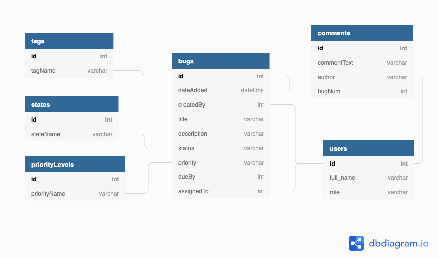

# Sqaush 
## find your bugs and squash them

### Product Summary: 
Squash will be a bug tracking application. It will have team capabilities as there will be 
Administrator and User roles. There will be a simple interface allowing all users to view
bug information, and an interface for admin to access assignment tools, etc.

**Initial Goal**: 
Sqaush will run as a web application. It will have a simple, yet elegance, front-end
in HTML / CSS / JavaScript. It will have a backend in node.js and mySQL.

**Long-Term Goal**:
Sqaush will be adapted in different stacks to show versatility. It will also be wrapped in 
Electron so it can stand alone as an application.

**User Stories:**
*1)* Squash will be secured via authentication/authorization (AuthO?).

*2)* Bugs can be entered into the tracker. Each bug will have a title and description, along with
assignment information, priority, status, appropriate tags (sorting), dueBy date.

*3)* Bugs can have status updates entered by the assigned user OR admin.

*4)* Bugs can be submitted by any user, but will be approved and assigned only by admin.

*5)* App will include some kind of aggregate data visualization.

#### Progress

I am currently looking at the database design. The following is a representation of what I 
think is needed thus far. I will begin wireframing for front-end UI next.

